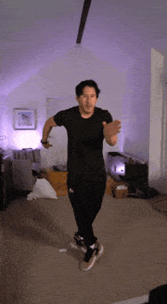

  🟧🟪🟩🟥🟦🟪🟧🟩🟨🟦🟥🟩🟪🟧🟨🟦🟪🟥🟩🟧🟨🟦🟪🟥🟩🟨🟧🟦🟪🟥🟩🟨🟥🟦🟪🟧🟩🟨🟦🟥🟩🟪🟧 
  ⬛🟪🟩⬛🟦🟪🟧🟩🟨🟦🟥🟨🟪🟧⬛🟦🟪⬛🟩🟧🟨🟦🟪🟥🟩⬛🟧🟦🟪⬛🟩🟨⬛🟦🟪🟧🟩🟨🟦🟥🟨🟪🟧 
  ⬛🟪⬛⬛⬛🟪🟧🟩⬛🟦🟥🟨⬛🟧⬛⬛🟪⬛⬛🟧🟨🟦⬛🟥🟩⬛⬛🟦🟪⬛⬛🟨⬛⬛🟪🟧🟩⬛🟦🟥🟨⬛🟧 
  ⬛⬛⬛⬛⬛⬛🟧⬛⬛⬛🟥⬛⬛⬛⬛⬛⬛⬛⬛⬛🟨⬛⬛⬛🟩⬛⬛⬛⬛⬛⬛⬛⬛⬛⬛🟧⬛⬛⬛🟥⬛⬛⬛ 
  ⬛⬛⬛⬛⬛⬛⬛⬛⬛⬛⬛⬛⬛⬛⬛⬛⬛⬛⬛⬛🟨⬛⬛⬛⬛⬛⬛⬛⬛⬛⬛⬛⬛⬛⬛⬛⬛⬛⬛⬛⬛⬛⬛

  

  <a href="https://git.io/typing-svg">
    >>+[Welcome+To+My+World]+<<<;>>>+[I+Am+Umay]+<<<;>>>+[Call+Me+Cicikus]+<<<" alt="Typing SVG" />
  </a>

 

  

  >>+CONSOLE;>>>+ABOUT_ME" alt="CONSOLE" />

  > {WARNING}: IF YOU ARE VIEWING THIS IN LIGHT MODE, I AM NOT RESPONSIBLE FOR YOUR BLEEDING EYES. SWITCH TO DARK MODE.
  > 
  > Hey there, it's surprising that you made it all the way here. This is your very own developer (can I call myself a game dev?), Umay.
  >
  > Yes, I am female. Those pronouns under my profile picture actually mean what they mean. I am 22 years old and trying to build myself a humble empire made of money.
  >
  > For those who are curious about my hobbies, they include playing piano, playing video games and being constantly sleep deprived. 
  >
  > Make yourself at home if you are going to check out my repositories and my ultra-amazing projects.

 >>+INVENTORY;>>>+THINGS_I_KNOW" alt="INVENTORY" />
 

  >>+COMM_LINK;>>>+CONTACT_ME" alt="COMM_LINK" />
   
  
  &nbsp;
  

 
 

  

    <i>p.s. just a friendly reminder that no matter how much you optimize your life, you can still get one-shotted by a random pigeon. stay paranoid, we might be in a simulation.</i>
  

  ⬛⬛⬛⬛⬛⬛🟪⬛⬛⬛⬛⬛⬛⬛⬛⬛⬛⬛⬛🟥⬛⬛⬛⬛⬛⬛⬛⬛⬛⬛⬛⬛⬛⬛⬛🟪⬛⬛⬛⬛⬛⬛⬛ 
  ⬛⬛⬛⬛⬛🟦🟪⬛⬛⬛⬛🟧⬛⬛⬛⬛⬛⬛🟩🟥⬛⬛⬛⬛⬛⬛🟨⬛⬛⬛⬛⬛⬛⬛🟦🟪⬛⬛⬛⬛🟧⬛⬛ 
  ⬛🟩⬛⬛🟨🟦🟪🟧⬛🟦🟧🟧⬛🟨⬛🟪⬛🟦🟩🟥🟧⬛⬛🟥⬛🟩🟨🟦⬛⬛⬛🟩⬛⬛🟨🟦🟪🟧⬛🟦🟧🟧⬛ 
  🟨🟩🟦⬛🟥🟦🟪🟧⬛🟩🟦🟧🟥🟨🟩🟪⬛🟨🟩🟥🟨🟧🟦🟥⬛🟧🟨🟦🟪⬛🟨🟩🟦⬛🟥🟦🟪🟧⬛🟩🟦🟧🟥 
  🟨🟩🟦🟥🟥🟦🟪🟧🟨🟩🟦🟧🟥🟦🟩🟪🟧🟨🟩🟥🟨🟪🟦🟥🟩🟧🟨🟦🟪🟩🟨🟩🟦🟥🟥🟦🟪🟧🟨🟩🟦🟧🟥

